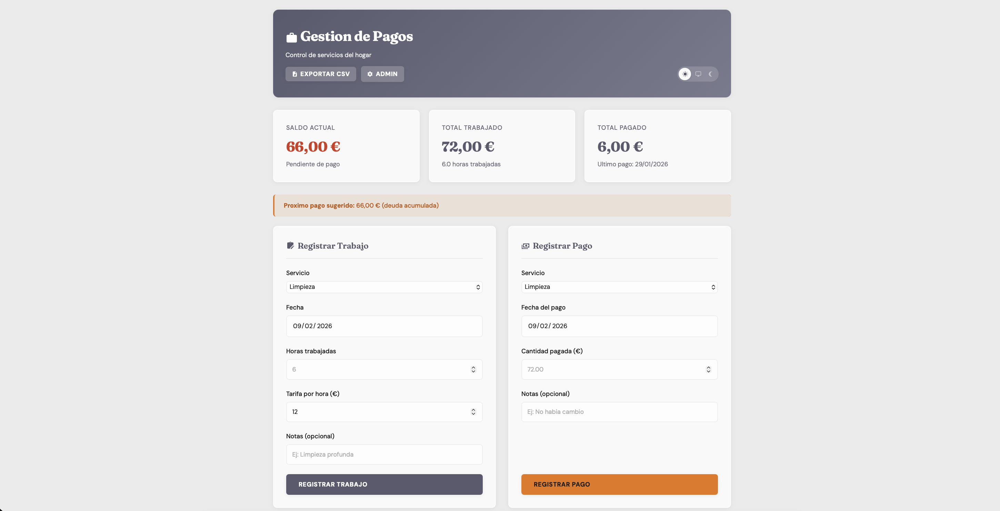
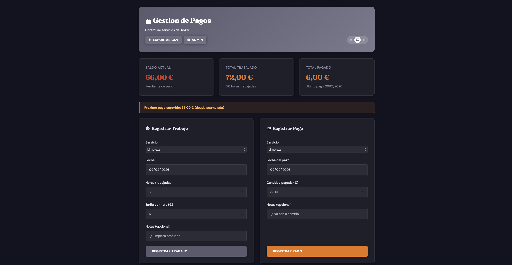

# Gestion de Pagos

Lightweight web application for managing household service payments. Track work hours, payments, and balances for services like cleaning, gardening, and more.

[](https://hub.docker.com/r/mbraut/gestion-pagos)

## Screenshots

### Light Mode


### Dark Mode


## Features

- Register work entries (hours, rates, notes) and payments
- Real-time balance dashboard with payment alerts
- Interactive balance evolution chart (Chart.js)
- Full movement history with filters by service and type
- CSV export
- Admin panel: service management, backups, theme customization, maintenance
- Light/dark theme with automatic system detection
- Multi-language (Spanish/English) with automatic browser detection
- MDI icons via Iconify
- Customizable color scheme from the admin panel
- SQLite database (no external dependencies)
- Responsive design (mobile, tablet, desktop)

## Quick Start with Docker

```bash
docker run -d \
  -p 8080:80 \
  -v gestion-pagos-data:/var/www/html/data \
  --name gestion-pagos \
  --restart unless-stopped \
  mbraut/gestion-pagos:latest
```

Open `http://localhost:8080` in your browser.

### Docker Compose / Portainer Stack

```yaml
services:
  gestion-pagos:
    image: mbraut/gestion-pagos:latest
    container_name: gestion-pagos
    ports:
      - "8080:80"
    volumes:
      - gestion-pagos-data:/var/www/html/data
    restart: unless-stopped

volumes:
  gestion-pagos-data:
```

```bash
docker compose up -d
```

## Manual Installation

### Requirements

- PHP 8.0+ with PDO and SQLite3 extensions
- Apache with mod_rewrite enabled
- Modern web browser

### Steps

1. Copy files to web server root:

```bash
sudo cp -r gestion-pagos/* /var/www/html/
```

2. Set permissions:

```bash
sudo chown -R www-data:www-data /var/www/html/
```

3. Enable mod_rewrite:

```bash
sudo a2enmod rewrite
sudo systemctl restart apache2
```

4. Open `http://your-server/` in your browser.

## Project Structure

```
gestion-pagos/
├── index.html              # Main page (dashboard, forms, history)
├── admin.html              # Admin panel
├── .htaccess               # Apache config (security, cache, routes)
├── api/
│   ├── config.php          # General config and helper functions
│   ├── database.php        # Database class (SQLite CRUD)
│   ├── records.php         # Records API (work and payments)
│   ├── admin.php           # Admin API (services, theme, backups)
│   └── import.php          # Data import
├── assets/
│   ├── css/
│   │   └── common.css      # Shared styles (variables, dark mode, components)
│   ├── js/
│   │   └── app.js          # Shared JS module (i18n, theme, icons)
│   └── lang/
│       ├── es.json         # Spanish translations
│       └── en.json         # English translations
├── data/
│   ├── pagos.db            # SQLite database
│   ├── services.json       # Service configuration
│   ├── theme.json          # Custom theme colors
│   └── backups/            # Automatic database backups
└── share/
    └── favicon/
        └── favicon.ico
```

## API Reference

### Records (api/records.php)

| Method | Endpoint | Description |
|--------|----------|-------------|
| GET | `?path=records` | Get all records |
| GET | `?path=records&service=X` | Filter by service |
| GET | `?path=stats` | General statistics |
| GET | `?path=backup` | Create database backup |
| POST | `?path=work` | Register work entry |
| POST | `?path=payment` | Register payment |
| PUT | `?path=record/{id}` | Update record |
| DELETE | `?path=record/{id}` | Delete record |

### Admin (api/admin.php)

| Method | Endpoint | Description |
|--------|----------|-------------|
| GET | `?action=getServices` | List services |
| GET | `?action=getStats` | System statistics |
| POST | `action: addService` | Add service |
| POST | `action: updateService` | Update service |
| POST | `action: deleteService` | Delete service |
| POST | `action: optimizeDB` | Optimize database |
| POST | `action: cleanBackups` | Clean old backups |
| POST | `action: saveTheme` | Save custom theme |
| POST | `action: deleteTheme` | Reset theme |
| POST | `action: deleteAllRecords` | Delete all records |

## Data Persistence

All application data is stored in `/var/www/html/data`:

| File | Description |
|------|-------------|
| `pagos.db` | SQLite database (records, balances) |
| `services.json` | Service configuration |
| `theme.json` | Custom theme colors |
| `backups/` | Automatic database backups |

When using Docker, mount a volume to `/var/www/html/data` to persist data across container restarts.

## Tech Stack

| Component | Technology |
|-----------|------------|
| Backend | PHP 8.2 + SQLite3 |
| Frontend | HTML5, CSS3, Vanilla JavaScript |
| Charts | Chart.js 4 |
| Icons | Iconify MDI |
| Fonts | DM Sans + Fraunces (Google Fonts) |
| Container | Docker (php:8.2-apache) |

## License

Private use - Developed for personal household management.
